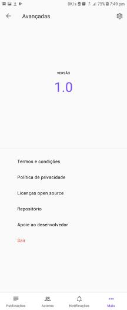

# Reaque
Reaque is where you share and read about experiences in Mozambique. Intend to show and find what great things we can do here now. Personal comments about it and a cover photo. Or just sharing a thought with those for who you are the favorite!

## Getting started
The app right now isnt avaible in none android apps repository. If you are an developer, you can make the build by cloning this and you already know it. Just take a look brief at the requirements section before.

## Pre-requesites
Here are some basic technical stuff. If you are an user, thank you for being here. You are free to skip right to see some screenshots at the bottom of this file. Or you can read the contributing section if you want to get me some kind of help.

### For developers only
This project is built throught [Android Studio 3.3.2](https://androidstudio.googleblog.com/2019/03/android-studio-332-available.html), following the new [Android Architecture Component](https://developer.android.com/topic/libraries/architecture) ( including _**databinding**_, _**navigation**_ and _**lifecycle**_) and last but not least the [MVVM pattern](https://en.wikipedia.org/wiki/Model–view–viewmodel).

## Version
Still on beta now.

### For developers only
I use git for versioning. Please read Contributing section.

## Licenses
   Copyright 2019 Horácio Flávio Comé Júnior

   Licensed under the Apache License, Version 2.0 (the "License");
   you may not use this file except in compliance with the License.
   You may obtain a copy of the License at

       http://www.apache.org/licenses/LICENSE-2.0

   Unless required by applicable law or agreed to in writing, software
   distributed under the License is distributed on an "AS IS" BASIS,
   WITHOUT WARRANTIES OR CONDITIONS OF ANY KIND, either express or implied.
   See the License for the specific language governing permissions and
   limitations under the License.

   I DO NOT TAKE ANY KIND OF CREDIT FOR THE PICTURES USED IN THE POSTS. THEY'RE ALL THIRD PARTY AND I JUST DOWNLOADED THEM FROM THE WEB!
   
## Contributing
This project is open and belong to all of us who feel it is a need, and have fun with it.
It is great to see you looking to help some way. There are plenty of this you can do. As a user, you make donation to help mantain the financial costs of building this product. Ill would be gratefull too if you just email me with you personal review. Plus, you can also help me get the texts in other languages like english, or our any you want. Whatever, just let me know.

### For developers only
You can make pull requests at anytime. There are welcome. It would be good if you follow the coding style so others can easily take advantage of it. Thank you for being here.
If you feel the need to touch the model part or the backend it self, please email me describing your intentions. Also could you visit the **issues** list, from time to time? It would be great!

## Screenshots
This is how it looks on an 5.7 inch phone running [Android Nougat](https://www.android.com/versions/nougat-7-0/)

           